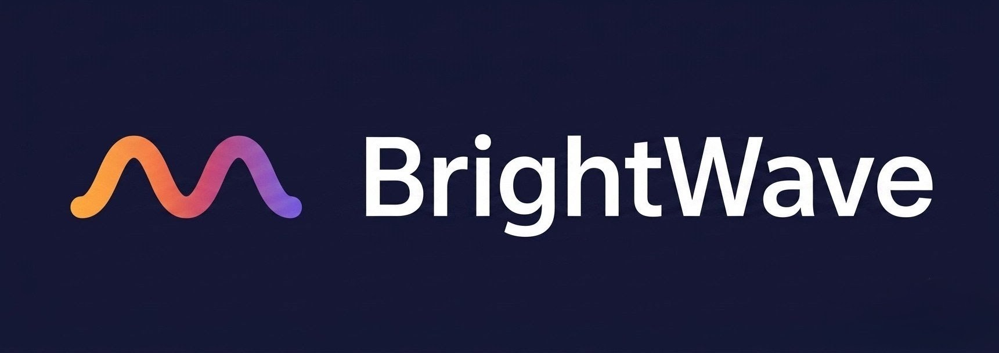

# Title

BrightWave Studio

## Screenshot

## Description

A fully custom, modern studio website built with React, TypeScript, Tailwind CSS and Vite.
Designed to show new/small/medium-sized business owners what a fast, handcrafted site looks and feels like.

## Project Purpose

This project serves as the official BrightWave Studio website. It showcases real sections,
real UX, real templates, and a real studio flow — giving prospects a clear sense of how I build,
how I communicate, and what working together looks like.

## Tech Stack

- React 
- TypeScript
- Vite
- Tailwind CSS

## Current Status

- Fully functional demo — builds and lints clean
- All sections implemented: Hero, Services, Portfolio, Why Choose Us,
  Contact, Footer
- 3 portfolio templates are live, clickable routes (`/work/...`), each a
  full standalone landing page
- Contact form is UI-complete but not wired to a real backend — it
  simulates a send and shows a confirmation state
- No real client testimonials, case studies, or production assets yet —
  content is illustrative

## Live Features

- Crisp live chat fully integrated and mobile-synced
- Real-time visitor tracking via Crisp
- Custom branded chatbox with welcome message
- Contact form confirmation state with UX polish
- Fully responsive across mobile, tablet, and desktop
- Production deployment on Vercel

## Next Steps

- Instagram Growth Showcase using the official Instagram Graph API
- Add follower count + engagement metrics to the site
- Create a Facebook Page and link Instagram Business account
- Implement serverless API route for Instagram data
- Add caching layer for stable API performance
- Add SEO metadata
- Add a privacy policy
- Add analytics
- Testimonials to get ready

## End-Project Considerations

- Buy `brightwavestudio.com` and set up `hello@` on it
- Add analytics before driving traffic to it
- Revisit copy once there's a first real client project to reference

## Changelog

### 08/08/2026
- Updated spacing, layout, and UI polish across all sections
- Improved scroll behavior and button interactions
- Enhanced typography and visual hierarchy
- Cleaned component structure and removed unused code
- Verified Tailwind v4 configuration and build stability

### 10/08/2026

### stack
- Crisp chat integration
- Calendly scheduling
- Suoabase

### current status
- Crisp chat integration added
- Calendly booking flow added
- Planned testimonials
- Fully responsive

### live features
- Pricing section added
- FAQ section answering common questions
- About section

### 13/08/2026
Typography & Palette Enhancements
- Added TypographyPreview page showcasing the full type system (display, headings, body, caption, label)
- Captured and integrated the Bloom Market typography screenshot into the case study
- Updated the Screenshot component to support real image rendering (previously only accepted labels)
- Refactored case study structure to include the new typography section with proper visual hierarchy
- Resolved merge conflict in App.tsx and verified routing for /typography-preview
- Added palette screenshot to the Bloom Market case study (Issue #1 completion)
- Confirmed build stability after UI additions and component updates
- Cleaned minor layout inconsistencies across the case study page

## Author

Yoichi dev